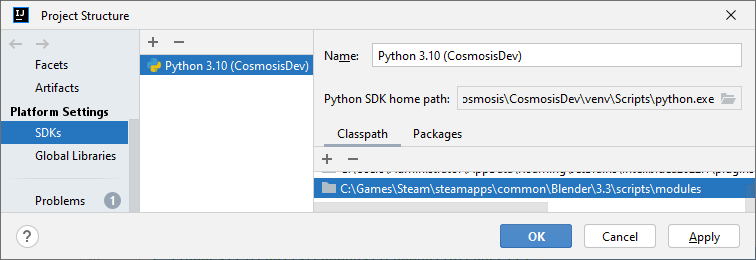

## General
We don't have many rules here. Just ensure you have a proper IDE setup, and
that you at least try you follow PEP 8 rules (any good IDE will warn you if
PEP 8 rules are not being followed). If following these rules hurt
maintainability or functionality, ignore the warning when you're absolutely
sure.

## Adding a new entry

### Adding a new section
Go to `Mesh definitions and in-application manual`.
Have a look at how the other items are done, for example `areaLight`.
You will notice that each section has the following:
* required parameters 
* optional parameters
* an in-app description

The easy part starts with just duplicating on of the existing entries and
modifying the parameters and description.

### Addin your own parameters
If you need custom parameters, go to the `Optional menu items section` in the
`ObjectCosmosisObjectProperties` class. There, you can create new parameters,
which you may them include in the code you created above.

### Testing your changes
Place `__init.py` inside a directory called `CosmosisDev`, and zip it. You may
then install via Blender.

### Submitting changes
Feel free to raise a PR with your changes if it's relevant to the official
Cosmosis project. Don't worry about version bumps, we'll handle that for you.

## Basic IDE auto-completion
_Note: the below instructions are for IntelliJ, though they may help you figure
out how to do the same in other IDEs such as VSCode._

Start by installing the Python plugin, if not already installed.

In order for the IDE to offer completion suggestions for Blender, it needs to
read the Blender `bpy` module.

Start by opening up your copy of Blender, and go to the scripting tab. in the
console, run `bpy.__file__`. For example:
```idle
PYTHON INTERACTIVE CONSOLE 3.10.8 (main, Oct 18 2022, 21:01:35) [MSC v.1928 64 bit (AMD64)]

Builtin Modules:       bpy, bpy.data, bpy.ops, bpy.props, bpy.types, bpy.context, bpy.utils, bgl, blf, mathutils
Convenience Imports:   from mathutils import *; from math import *
Convenience Variables: C = bpy.context, D = bpy.data

>>> bpy.__file__
'C:\\Games\\Steam\\steamapps\\common\\Blender\\3.3\\scripts\\modules\\bpy\\__init__.py'

>>> 
```

Copy the output path that your command spits out.

Next, inside IntelliJ, go to `File -> Project Structure -> SDKs`.

If you do not already have a Python SDK setup click the `+` button in the top
left, select `Add Python SDK...` to set up the initial Python environment.
You'll want to try closely match the Python version that Blender is using,
because Python is notorious for hard-breaking features and changing syntax
across versions.
You may skip this step if you already have that set up (for new setups you
will also need to go to
`File -> Project Structure -> Project Settings -> Project` and ensure your
SDK is set there).

Once you have a Python SDK setup ready, ensure the `Classpath` tab is
selected, and then press the `+` button (this was called `Add...` in older
versions). Go to the directory of the file that `bpy.__file__` spat out, and
go 2 directories up to the `modules` directory. For example, if your `bpy`
file path is:
```
C:\MyDir\Blender\modules\bpy\__init__.py
```
then you'll want to select:
```
C:\MyDir\Blender\modules
```

Example:



Your IDE should now resolve the `bpy` module and offer basic completion.
