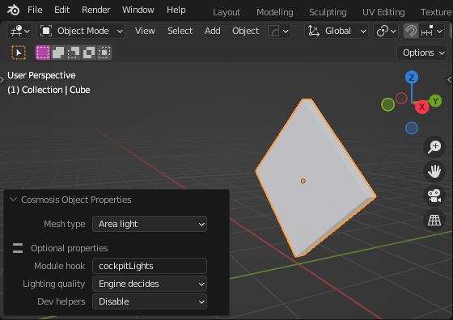

# Cosmosis Blender Add-on

## Usage

**Note**: This add-on targets Cosmosis 0.74 and up. Lower versions will not
work with this add-on.

This add-on eliminates the need to learn Cosmosis mesh codes. Simply click the
mesh you want to configure, press `Insert` (or search for Cosmosis Object
Properties), and select the item you want:

<!--
## Installation

Download the latest zip from the [latest releases here], and
[menu -> addons -> etc]
-->
